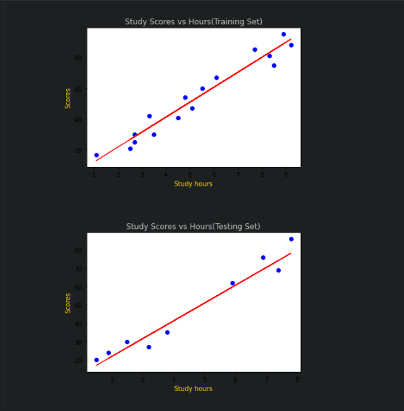

# Implementation-of-Simple-Linear-Regression-Model-for-Predicting-the-Marks-Scored

## AIM:
To write a program to implement the simple linear regression model for predicting the marks scored.

## Equipments Required:
1. Hardware – PCs
2. Anaconda – Python 3.7 Installation / Moodle-Code Runner

## Algorithm
1. Import all the necessary librariesand modules.
2. Upload the .csv file into folder.
3. Assign the variables to the respective data in the file.
4. Display the data in a graph using matplotlib.pyplot.


## Program:
```
/*
Program to implement the simple linear regression model for predicting the marks scored.
Developed by: Ragul A C
RegisterNumber:  212221240042
*/
import numpy as np
import pandas as pd
import matplotlib.pyplot as plt
from sklearn.model_selection import train_test_split
from sklearn.linear_model import LinearRegression
data=pd.read_csv("student_scores - student_scores.csv")
data.head()
data.tail()
data.isnull()
X=data.iloc[:,:-1].values
print(X)
Y=data.iloc[:,1].values
print(Y)
X_train,X_test,Y_train,Y_test=train_test_split(X,Y,test_size=1/3,random_state=0)
Regressor=LinearRegression()
Regressor.fit(X_train,Y_train)
y_pred=Regressor.predict(X_test)
plt.scatter(X_train,Y_train,color="Blue")
plt.plot(X_train,Regressor.predict(X_train),color="Red")
plt.title("Study Scores vs Hours(Training Set)",color="silver")
plt.xlabel("Study hours",color='gold')
plt.ylabel("Scores",color='gold')
plt.show()
plt.scatter(X_test,Y_test,color="Blue")
plt.plot(X_test,Regressor.predict(X_test),color="Red")
plt.title("Study Scores vs Hours(Testing Set)",color="silver")
plt.xlabel("Study hours",color='gold')
plt.ylabel("Scores",color='gold')
plt.show()
```

## Output:



## Result:
Thus the program to implement the simple linear regression model for predicting the marks scored is written and verified using python programming.
